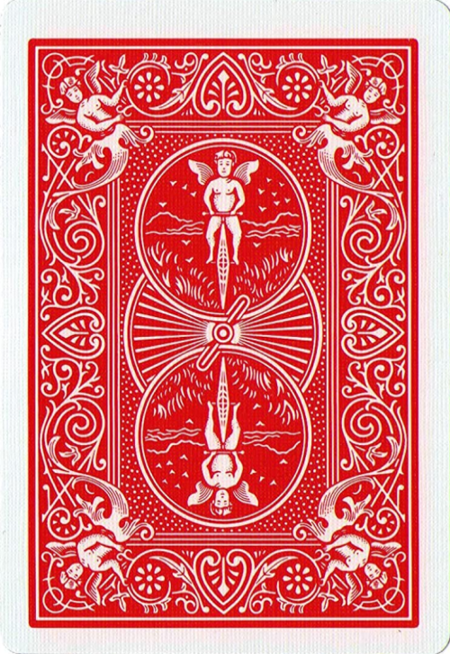
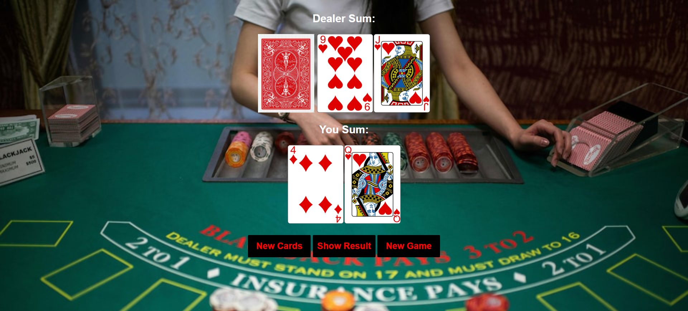

<p align="center">
  
</p>

<h1 align="center">🃏 Blackjack Game</h1>

<p align="center">
  <em>A classic, interactive, and responsive Blackjack card game built with pure HTML, CSS, and Vanilla JavaScript.</em>
</p>

<p align="center">
  
  
  
  
</p>

<p align="center">
  <a href="https://waleedtarbosh.github.io/Blackjack-Game/">🌐 Live Demo ⚡</a>
  &nbsp;&nbsp;|&nbsp;&nbsp;
  <a href="#-screenshots-️">📸 Screenshots</a>
</p>

---

## 📖 Project Description

**Blackjack Game** is a web-based implementation of the classic casino card game, designed with simplicity and responsiveness in mind. Built entirely using **Vanilla JavaScript, HTML5, and CSS3** without any external libraries or frameworks.

The game features dynamic card rendering, automatic score calculation (including special handling for Aces), and responsive design adapting from desktop down to mobile devices. 

> 💡 **Why this project stands out:** It demonstrates solid understanding of JavaScript logic, DOM manipulation, array and object handling, and basic responsive web design principles using media queries.

---

## 📸 Screenshots 🖼️

<div align="center">
  <table>
    <tr>
      <th align="center">Screen</th>
      <th align="center">🖥️ Desktop View</th>
      <th align="center">📱 iPad Pro</th>
      <th align="center">📲 iPhone 14 Pro Max</th>
    </tr>
    <tr>
      <td align="center"><strong>Game Screen</strong></td>
      <td align="center"></td>
      <td align="center"></td>
      <td align="center"></td>
    </tr>
  </table>
</div>

---

## 📖 Table of Contents

- [🛠️ Technologies & Styles Used](#️-technologies--styles-used-)
- [✨ Core Features](#-core-features)
- [📂 Folder Structure](#-folder-structure)
- [🚀 Installation Instructions](#-installation-instructions)
- [💻 How to Run the Development Server](#-how-to-run-the-development-server)
- [🤝 How to Contribute](#-how-to-contribute)
- [✍️ Author](#️-author)

---

## 🛠️ Technologies & Styles Used 🎨

| Technology | Purpose | Details |
|:---:|:---|:---|
|  | **Structure** | Semantic HTML5 structure for game layout |
|  | **Styling** | Layout, responsive media queries, and styling |
|  | **Logic** | Game rules, DOM updates, event handling |

### 🎨 Design System

```text
🎨 Color Palette
├── Background     → custom background image / RGB(188, 36, 60) for smaller screens
├── Text           → #ffffff (White)
├── Buttons        → Black background, Red text

📐 Layout
├── Breakpoints    → 575px (mobile) | 576-991px (tablet) | 992px+ (desktop)
```

---

## ✨ Core Features

### 🎯 Gameplay Interface
- ✅ **Dynamic Deck Building** generating 52 unique cards
- ✅ **Card Shuffling** utilizing random algorithms
- ✅ **Hit & Stay Mechanics** for classic Blackjack strategy
- ✅ **Automatic Ace Value Calculation** handling (1 vs 11 logic)
- ✅ **Win/Loss/Tie Detection** instantly updating game state

### 📱 Responsive Design
- ✅ **3 Breakpoints**: Desktop, Tablet (576-991px), Mobile (≤575px)
- ✅ **Adaptive Background** changing from image to solid color on smaller screens
- ✅ **Scaled Elements** for optimal viewing on any device

---

## 📂 Folder Structure

```text
Blackjack-Game/
│
├── 📄 index.html               # Main entry point for the game
├── 📄 style.css                # Styling and responsive rules
├── 📄 main.js                  # Core game logic and DOM manipulation
├── 📄 README.md                # Project documentation
│
└── 📁 cards/                   # Directory containing card images
    ├── 🖼️ BACK.png             # Hidden card image
    ├── 🖼️ bg.png               # Desktop background image
    └── 🖼️ [Card Image Files]   # 52 standard playing card images
```

---

## 🚀 Installation Instructions

### Prerequisites

- Any modern web browser (Chrome, Firefox, Safari, Edge)

### Steps

**1. Clone the repository:**

```bash
git clone https://github.com/waleedtarbosh/Blackjack-Game.git
```

**2. Navigate to the project directory:**

```bash
cd Blackjack-Game
```

**3. Open in your browser:**

```bash
# Simply open the index.html file in your browser
# Option 1: Double-click index.html
# Option 2: Right-click → Open with → Your browser
```

---

## 💻 How to Run the Development Server

While you can open `index.html` directly, using a live server provides auto-reload on file changes:

### VS Code Live Server (Recommended)

```text
1. Install the "Live Server" extension in VS Code
2. Right-click on index.html
3. Select "Open with Live Server"
4. Browser opens at http://127.0.0.1:5500
```

---

## 🤝 How to Contribute

Contributions are always welcome! Here's how you can help:

```text
1. 🍴 Fork the repository
2. 🌿 Create a feature branch        →  git checkout -b feature/NewFeature
3. ✏️  Make your changes              →  Edit files
4. 💾 Commit your changes            →  git commit -m "Add: NewFeature"
5. 📤 Push to the branch             →  git push origin feature/NewFeature
6. 🔃 Open a Pull Request            →  Compare & submit on GitHub
```

---

## ✍️ Author

<p align="center">
  <a href="https://github.com/waleedtarbosh">
    
  </a>
</p>

<p align="center">
  <strong>Waleed Tarbosh</strong><br/>
  Front-End Developer
</p>

---

<p align="center">
  <sub>⭐ If you found this project useful, please consider giving it a star on GitHub! ⭐</sub>
  <br/><br/>
  <a href="#-blackjack-game">⬆️ Back to Top</a>
</p>
